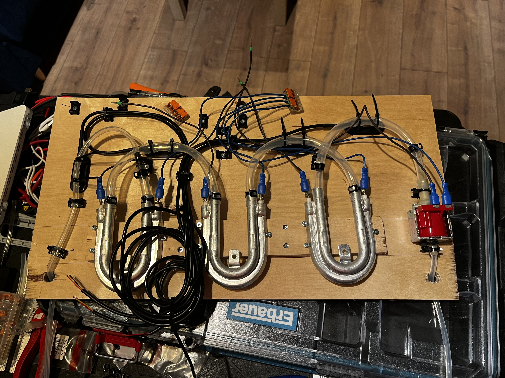
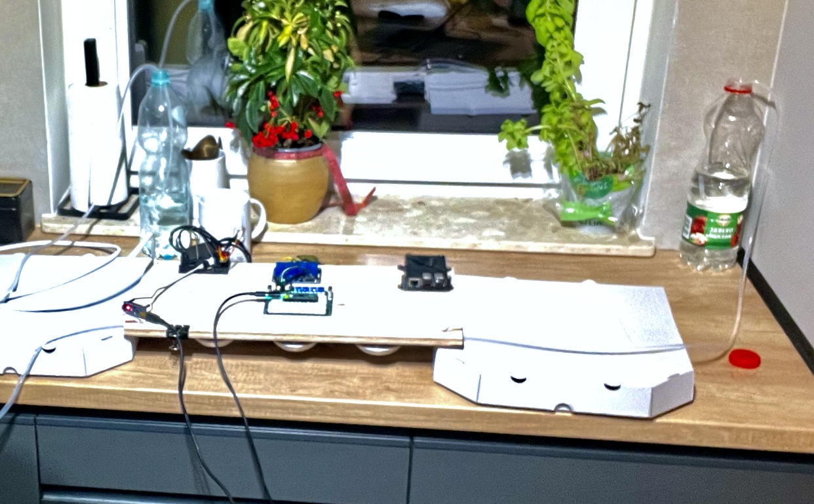
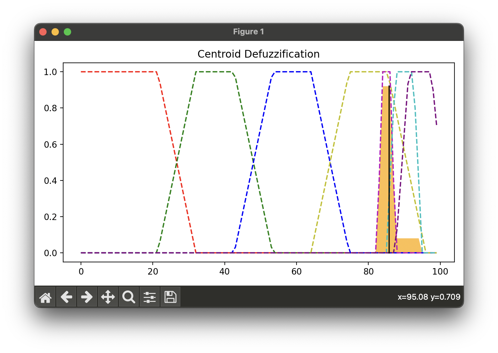

# Tea Machine Fuzzy Controller

## Project Overview
This repository contains scripts, applications, and resources for the Tea Machine Fuzzy Controller project. This project was developed as part of a course during studies as a 'projekt zaliczeniowy.' The goal was to develop a fuzzy controller and test it on real devices, specifically flow heaters purchased for the tea machine. The system was designed to run on a Raspberry Pi.

## Directory Details

### `iss_proj_main_nano/`
Firmware for the Arduino Nano microcontroller, used for reading temperatures from DS18B20 sensors.

### `iss_proj_main_pico/`
Firmware for the Raspberry Pi Pico, controlling the machine's heaters through relays. Includes pin configurations.

### `python_desktop_app/`
Python-based desktop application to interface with the tea machine.

### `shell_scripts/`
Shell script to pull the newest version from the repository, enabling quick software updates during development.

### `web_app/`
Web application interface for the tea machine.

## Usage

### Running the Python Desktop App
1. Navigate to the `python_desktop_app` folder:
   ```bash
   cd python_desktop_app
   ```
2. Run the application using Python:
   ```bash
   python main.py
   ```
3. Follow the on-screen instructions to interface with the tea machine.

### Reading Temperatures
Use the firmware in the `iss_proj_main_nano/` folder with an Arduino Nano to read temperatures from DS18B20 sensors:
1. Flash the `iss_proj_main_nano.ino` file onto the Arduino Nano.
2. Connect the Arduino to a computer or Raspberry Pi via USB.
3. Open a serial terminal (e.g., Arduino IDE Serial Monitor) at the correct baud rate.
4. Send the following commands to read temperatures from each sensor:
   - `T0-?` for the first sensor
   - `T1-?` for the second sensor
   - `T2-?` for the third sensor
   - `T3-?` for the fourth sensor
5. The Arduino will respond with the temperature reading in the format `T0-XX.XC` (e.g., `T0-23.5C`).

### Controlling Heaters Manually
Use the firmware in the `iss_proj_main_pico/` folder with a Raspberry Pi Pico to control heaters through relays:
1. Flash the `iss_proj_main_pico.ino` file onto the Raspberry Pi Pico.
2. Connect the Pico to a computer or Raspberry Pi via USB.
3. Open a serial terminal at the correct baud rate.
4. Send the following commands to control the heaters:
   - `H1-ON` to turn on heater 1
   - `H1-OFF` to turn off heater 1
   - `H2-ON` to turn on heater 2
   - `H2-OFF` to turn off heater 2
   - `H3-ON` to turn on heater 3
   - `H3-OFF` to turn off heater 3
5. The Pico will confirm each command with an `-OK` response, e.g., `H1-ON-OK`.

### Updating Software
To quickly pull the latest version of the repository during development:
1. Navigate to the `shell_scripts` folder:
   ```bash
   cd shell_scripts
   ```
2. Run the update script:
   ```bash
   ./run_app.sh
   ```
3. The script will fetch the newest version of the repository.

## Testing



Tests were conducted on a prepared mechanical model made of plywood, incorporating three flow heaters, the TeaMachineControlBoard, relay module, a Raspberry Pi Pico, and an Arduino Nano. The setup demonstrated full functionality and confirmed the system works as intended.





